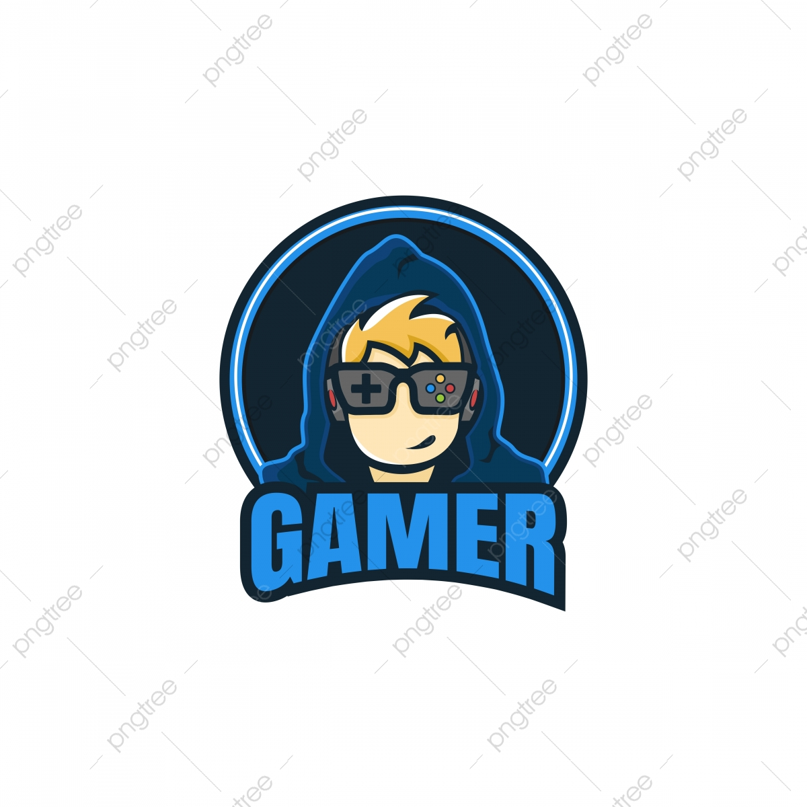

<a name="readme-top"></a>

<!-- PROJECT LOGO -->
<br />
<div align="center">
  
  


  <h3 align="center">GameDudes Blog Website</h3>

  <p align="center">
    This Blog Website is made for my university assignment. scroll down for more info.
    <br />
    <a href="https://gamedudes.herokuapp.com/"><strong>Explore the Blog »</strong></a>
    <br />
    if above link is not working, use this link :point_down:
    <br />
    <a href="https://gamedudes-blog-website.onrender.com"><strong>Explore the Blog »</strong></a>
    <br />
    <br />
  </p>
</div>


<!-- TABLE OF CONTENTS -->
<details>
  <summary>Table of Contents</summary>
  <ol>
    <li>
      <a href="#about-the-project">About The Project</a>
      <ul>
        <li><a href="#built-with">Built With</a></li>
      </ul>
    </li>
    <li>
      <a href="#getting-started">Getting Started</a>
      <ul>
        <li><a href="#prerequisites">Prerequisites</a></li>
        <li><a href="#installation">Installation</a></li>
      </ul>
    </li>
    <li><a href="#license">License</a></li>
    <li><a href="#contact">Contact</a></li>
  </ol>
</details>


<!-- ABOUT THE PROJECT -->
## About The Project

[![Product Name Screen Shot][product-screenshot]](https://example.com)

This Blog website is made for my university assignment.

This Blog website is only for gamers who are like to post upcoming games, share experiences about played games, and post latest news all about gaming platform.

<p align="right">(<a href="#readme-top">back to top</a>)</p>


### Built With

This Website is built with below technologies :point_down:

* ![MongoDB][MongoDB]

<p align="right">(<a href="#readme-top">back to top</a>)</p>


<!-- GETTING STARTED -->
## Getting Started

This is how to setting up this project locally.
To get a local copy up and running follow these simple example steps.

### Prerequisites

This is how to use the website and how to install packages locally.
* npm
  ```sh
  npm install
  ```
OR
* npm
  ```sh
  npm install npm@latest -g
  ```

### Installation

_Below instructions are how to setup and run this website lacally. Read this instructions very carefully!._

1. Create a database in MongoDB Atlas at [https://account.mongodb.com/account/login](https://account.mongodb.com/account/login) to get a cloud database service
   or you can create MongoDB locally.
2. Clone the repo
   ```sh
   git clone https://github.com/KanishaLiyanage/gamedudes-blog-web-expressjs.git
   ```
3. Install NPM packages
   ```sh
   npm install
   ```
4. Create `.env` file in root directory.
5. Enter your MongoDB Atlas database url in `.env`
   ```js
   const ATLAS_URL = 'ENTER YOUR MongoDB database url';
   ```

<p align="right">(<a href="#readme-top">back to top</a>)</p>


<!-- LICENSE -->
## License

Distributed under the MIT License. See `LICENSE.txt` for more information.

<p align="right">(<a href="#readme-top">back to top</a>)</p>


<!-- CONTACT -->
## Contact

* GitHub - [@KanishaLiyanage](https://github.com/KanishaLiyanage)
* LinkedIn - [@kanisha-liyanage](https://www.linkedin.com/in/kanisha-liyanage)
* Twitter - [@DilumKanisha](https://mobile.twitter.com/DilumKanisha)

Project Link: [https://github.com/KanishaLiyanage/gamedudes-blog-web-expressjs](https://github.com/KanishaLiyanage/gamedudes-blog-web-expressjs.git)

<p align="right">(<a href="#readme-top">back to top</a>)</p>


<!-- MARKDOWN LINKS & IMAGES -->
<!-- https://www.markdownguide.org/basic-syntax/#reference-style-links -->
[product-screenshot]: images/screenshot.png
[MongoDB]: https://img.shields.io/badge/MongoDB-4EA94B?style=for-the-badge&logo=mongodb&logoColor=white

